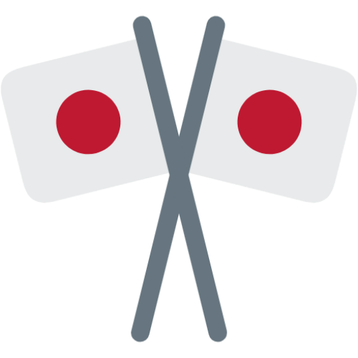
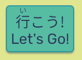
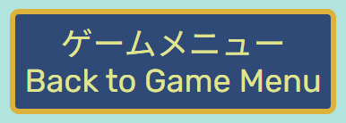

# **Learn Hiragana & Katakana**
## **Site Overview**
According to the [**U.S. Department of State's *Foreign Language Institute***](https://www.state.gov/foreign-language-training/), the Japanese language is one of five languages considered exceptionally difficult for native English speakers - taking, on average, around 2,200 hours (the equivalent of 6 years if a person were to practise for 1 hour every day) to achieve proficiency. This is, in no small part, due to Japan's use of three separate alphabets. While the largest and most complex alphabet used in Japan, named *kanji*, is made up of characters that are Chinese in origin, the remaining 2, named *hiragana* and *katakana* are unique to Japan and form the basis for all Japanese words. Japanese children are taught to read and write hiragana and katakana from a young age, and knowledge of both is a necessary prerequisite to being introduced to kanji steadily across 9 years of mandatory education.

In a similar way, it is necessary for anyone learning Japanese to recognise both the hiragana and katakana alphabets, as - technically speaking - the entire language could be written in just one or both of them (although, practically speaking, this would be a terrible idea!)

With Japanese being such a difficult language to learn for native English speakers, practise may never equal *perfect*, but practise WILL make *progress*, and gamifying that practise makes learning all the more fun.

Am I Responsive? displays of each page:

Homepage:

Hiragana page:

Katakana page:

## **Table of Contents:**
1. [**Site Overview**](#site-overview)
1. [**Planning stage**](#planning-stage)
    * [***Target Audiences***](#target-audiences)
    * [***User Stories***](#user-stories)
    * [***Site Aims***](#site-aims)
1. [**Current Website Features**](#current-website-features)
    * [***Colour Scheme***](#colour-scheme)
    * [***Typography***](#typography)
    * [***Features Present on All Pages***](#features-present-on-all-pages)
        * [*Favicon*](#favicon)
        * [*Header*](#header)
        * [*Footer*](#footer)
    * [***Homepage***](#homepage)
        * [*Choice of Game*](#choice-of-game)
        * [*Select Game*](#select-game)
    * [***Hiragana and Katakana Game Pages***](#hiragana-and-katakana-game-pages)
        * [*Game Area*](#game-area)
        * [*Current Score*](#current-score)
        * [*Back to Homepage*](#back-to-homepage)
    * [***JavaScript on Game Pages***](#javascript-on-game-pages)
        * [*Main Game Functions*](#main-game-functions)
        * [*Unique Score Message*](#unique-score-message)
1. [**Testing**](#testing)
1. [**Technologies Used**](#technologies-used)
1. [**Deployment**](#deployment)
1. [**Future Enhancements**](#future-enhancements)
1. [**Credits**](#credits)
    * [**Honourable Mentions**](#honourable-mentions)
    * [**Code References**](#code-references)
    * [**Content and Media**](#content-and-media)
    
## **Planning stage**
### **Target Audiences**

* People of all age groups who are learning Japanese at beginner - intermediate level who would like to use a fun game as a resource to develop and/or test their knowledge of the hiragana and katakana alphabets.

### **User Stories**

* As a user, I want to see the subject matter of the page.
* As a user, I want to navigate the page to find what I require quickly and easily.
* As a user, I want to test my knowledge of hiragana and katakana in a visually engaging way
* As a user, I want to be able to clearly choose which game to play
* As a user, I want feedback for my correct and incorrect answers, and a score that updates in real time

### **Site Aims**

* To provide an interactive experience for people of all age groups who are learning Japanese at beginner-intermediate level.
* To give users a clear choice between a hiragana game and katakana game, and provide a streamlined experience that reacts to their input and gives them feedback in real time.
* To provide users with a unique message when they have answered 10 questions, depending on their score.
* To give users the clear choice to play the game again as many times as they like, or choose to play the other game if they wish.

## **Current Website Features**

### **Colour Scheme**

This website's colour scheme was inspired by the following colour palette created by [**akula creative**](https://akulakreative.com/blog/2016/02/a-sea-and-space-inspired-color-palette) based on an image posted by NASA.

Japan is an island nation, so I wanted to include colours that the user can associate with the ocean, and serenity. The inclusion of the gold colour was something I intended on from the start, as it is inspired by the Japanese practice of [**Kintsugi (金継ぎ, "golden joinery")**](https://en.wikipedia.org/wiki/Kintsugi).

Below are two colour grids to show how the colours interact with each other from an accessibility perspective - one with just the main site colours, and the other with the additional colours used in the "correct" and "incorrect" classes when taking the quiz itself.

### **Typography**

Three fonts were used across this website - two of them for the English text, and one of them for the Japanese text.

For all instances of "Learn Hiragana and Katakana", "Hiragana Test!" and "Katakana Test!", the font "Righteous" was used. This font was chosen for its fun, bold style, that doesn't compromise readibaility. It gives them impression of a logo, which was perfect for this simple website. "Rubik" was used for all other English text on the website due to its clear readability, with slightly rounded styles that again give a fun feel to the website.

Originally, for the Japanese text, a font called "BIZ UDMincho" was used. Initially, this font was chosen because it resembled traditional Japanese calligraphy whilst also remaining fairly clear. However, as displayed in the below screenshot, it did make some of the characters much less legible (particularly the hiragana), and didn't align with the goal of having an easily accessible game for beginners.

Instead, "Noto Sans Japanese" was used as it's much clearer, and fits much better with the overall feel of the website.

All fonts were sourced from Google Fonts, as mentioned in the Credits.

### **Features Present on All Pages**

#### **Favicon**

The Favicon chosen for this website is the [**"crossed flags" emoji favicon**](https://favicon.io/emoji-favicons/crossed-flags/) from favicon.io - as mentioned in the Credits.

The "crossed flags" emoji depicts two Japanese flags crossing one another, and is often used in relation to celebrating Japanese culture [(**source**)](https://yaytext.com/emoji/crossed-flags/#:~:text=The%20crossed%20flags%20emoji%20shows,support%20the%20Japanese%20people%20%F0%9F%8E%8C).

Favicon in Chrome browser tab:

#### **Header**

The header can be found at the top of all three pages of the website, and is very simple in its design. It includes the site title in a centred position, using the font I chose for the logo-style text. No additional styling was added in CSS (such as hover styling), to give the impression that the text is an image logo.The header is responsive, but care was taken to make sure that it never takes up too much of the screen, so that the main page content is what sticks out the most to the user. Due to the more simplistic style of this website, the header does not include a navigation bar, but clicking on the site title will take you to the homepage, as the user would expect. The decision not to include a navigation bar was made due to there being a "Back to Game Menu" button below the game area on each page that is clear and intuitive, and allowed the option of including the Japanese text.

#### **Footer**

The footer also appears on all three pages of the website and contains a small amount of text explaining the purpose of the website. Initially, this was all, but the decision was made to also include a disclaimer stating that the website is for education purposes only.

Without disclaimer:

With disclaimer:

### **Homepage**

The homepage is fully responsive, and serves as the central hub through which the user can navigate to their chosen game.

The homepage on desktop:

The homepage on mobile:

#### **Choice of Game**

The main section of the website contains the two game choices - hiragana and katakana. Originally, these sections were to be called "Learn Hiragana/Katakana!", however the decision was made to change the wording to "Hiragana/Katakana Test!" due to the Japanese equivalent being much simpler, as the Japanese word for "test" is テスト - literally "te-su-to", a loan word from English.

The colours for the game sections are inverted, to make them visually distinct from one another whilst also remaining eye-catching and fitting with the overall colour scheme.

 

#### **Select Game**

The "button" to select each game is a styled anchor tag, to give the user the illusion of a button. When clicked, they direct the user to the respective html page that holds the content for the game. To make the page more interactive, an animation has been added to each of the "buttons" that give the impression of it jumping when hovered over. A shadow was added to emphasise this animation.

Originally, these "buttons" displayed the following text:

However, the first character used here is the Japanese kanji for "go". As this site is aimed at beginners-intermediates wanting to practise hiragana and katakana only, it seemed unreasonable to include a kanji character as it is, due to the kanji alphabet being more advanced than the scope of this website. As kanji characters can have multiple meanings and pronunciations, to assist with reading kanji the Japanese utilise a method of phonetic notation called *furigana* - "a Japanese reading aid consisting of smaller kana or syllabic characters printed either above or next to kanji (logographic characters) or other characters to indicate their pronunciation" [**(source)**](https://en.wikipedia.org/wiki/Furigana). Thankfully, W3C supports the use of furigana through [**ruby markup**](https://www.w3.org/International/articles/ruby/markup.en), and so the furigana for this kanji was added for increased readibility and accessibility for all levels of reading comprehension.

### **Hiragana and Katakana Game Pages**

As with the homepage, both game pages are fully responsive based on the device used to view them on. They are where the respective games run.

Hiragana game page on desktop:

Hiragana game page on mobile:

Katakana game page on desktop:

Katakana game page on mobile:

#### **Game Area**

The game area on each page contains four main sections: an h2 heading detailing which game is currently selected, a question area, an answer area containing four potential answers, and a current score section at the bottom. The game areas themselves are structured identically, but with different colour styling so that the user can distinguish the games from one another by colour as well as by reading the heading.

Hiragana game area:

Katakana game area:

The question area is visually distinct from the rest of the game area, centred above the four answer fields and with much larger text. Here, a Japanese character is displayed for the user to choose the phonetic answer for.

Hiragana question:

Katakana question:

The answers area contains four squares - one of which contains the correct phonetic answer for the question, and the other three contain a phonetic pulled from a list of the remaining characters in the relevant JavaScript file (detailed further in the JavaScript on Game Pages section). On a desktop, when the answers are hovered over, the same animation as the select game buttons is used, where the answer appears to move up slightly as the user hovers across. On mobile, this animation occurs when the user presses the answer.

The animation is small (so as not to be distracting or obstructive) so it is hard to catch in a screenshot, but below are two examples, the first where "mu" is the answer hovered over, and the second where "ru" is the answer hovered over:

The current score section is a clear, simple paragraph beneath the question & answers section of the game, that says "Current score: [0] / 10". The [0] is updated as the game progresses, if the answer the user has provided is correct. More detail is included in the JavaScript on Game Pages section.

#### **Back to Homepage**

Beneath the game area on each game page, there is a button that uses the Japanese katakana loan words for "game menu" above the English text "Back to Game Menu". The styling for this button is the same on both pages, to ensure that the user's familiarity with its function isn't compromised across either game. 

### **JavaScript on Game Pages**

#### **Main Game Functions**

Correct answer - hiragana 'ne':

Incorrect answer - hiragana 'su':

Correct answer - katakana 'ne':

Incorrect answer - katakana 'su':

Hiragana current score area updating:

Katakana current score area updating:

#### **Unique Score Message**

## **Testing**

A separate file has been created for information about testing. Please click the following link to access it: [**TESTING.md**](TESTING.md)

## **Technologies Used**

The technologies used in the making of this website are:

* HTML5
* CSS3
* JavaScript

## **Deployment**

This website was deployed on GitHub Pages. The following procedure was followed on desktop to achieve this:

* Starting at [**this project's repository**](https://github.com/emmacadavra/learn-hiragana/tree/main), navigate to the **'Settings'** tab
* In **'Settings'**, select **'Pages'** from the navigation menu on the left-hand side of the screen
* In **'GitHub Pages'**, find **'Source'** under **'Build and deployment'**
* Select the **'Main'** branch from the drop down menu and click **'Save'**
* A message is then displayed to indicate a successful deployment to GitHub pages, and provides a live link once it has finished fully deploying
The live link to the fully deployed website can be found here: [***https://emmacadavra.github.io/learn-hiragana/***](https://emmacadavra.github.io/learn-hiragana/)

## **Future Enhancements**

As with my first major project, I am limited by the current scope of my knowledge - particularly in JavaScript - as well as by time constraints.

If I had more time and knowledge, I would like to enhance this project in many ways.

* Firstly, I would like to generally add a little bit more educational content, such as information about the Japanese language, about the pronunciations, grammar, and so on. I'd also like to add more visual content alongside these.

* Secondly, I would like to include the option of audio to the questions - for example, when the character is displayed, being able to tap/click on it and have perhaps the Japanese text-to-speech function read the character's pronunciation to the user. This would greatly improve the effectiveness of this website as a helpful as well as fun learning resource.

* For the purposes of this project, I have used the 46 main hiragana character and 45 main katakana characters (the katakana ヲ (wo) is used so infrequently that it is omitted from most modern learning programmes). However, variations of many of these characters exist, known as dakuon and handakuon. The が (ga) in ひらがな (hi-ra-ga-na) is the dakuon form of か (ka), and these variations are of equal importance to the base characters when learning Japanese. I would like to include these characters, perhaps separately or under a different 'difficulty setting' for more confident learners.

* Lastly, following on from the idea of 'difficulty settings' - due to the nature of the script used to generate the games on this website, it would be possible to include kanji as an option. However, this would need much more thought and more advanced implementation (such as the inclusion of audio). Although Japanese contains around 50,000 kanji characters, only around 2,136 of them are regarded as necessary for functional Japanese literacy [**(source)**](https://en.wikipedia.org/wiki/Kanji). These 2,136 characters are separated by difficulty in the JLPTs (Japanese Language Proficiency Tests), and so this would need to be taken into consideration upon implementation.

## **Credits**

### **Honourable Mentions**

* [**Damon Kreft**](https://github.com/damon-kreft)

* [**Richard Wells**](https://github.com/D0nni387)

* [**Alicia Walker**](https://github.com/AliciaWalker01)

* [**Christina Webb**](https://github.com/c-webb-sfougaras)

* Thank you to my colleague Yuka who helped me out by checking the Japanese text on the website and within the JavaScript arrays, and making sure I hadn't made any mistakes!

### **Code References**

* This project follows the Code Institute 'Love Maths' code along project, and a lot of my starter knowledge in JavaScript has come from this project. As such there are some similarities in the code, for example in the "current score" section of each game page.

* To help me better understand how to implement the quiz-style functions needed to make this website's games work, I watched videos 1 - 4 in [**James Q Quick's "Build a Quiz App with HTML CSS AND JavaScript**](https://youtube.com/playlist?list=PLB6wlEeCDJ5Yyh6P2N6Q_9JijB6v4UejF) playlist on YouTube. I chose this tutorial because it implemented features I wished to include from the start, such as the correct/incorrect answer feedback to questions. This tutorial is for a quiz that shares a lot of similarity in terms of JavaScript functionality to what I have used for this website, and although I wrote the code for this project myself (unless otherwise stated) and have tried to make it as unique to me as possible, there are many instances of similar or even the same code being used. That said, there are a few instances where I have taken code directly from this tutorial, in some instances because it was my first time learning it, detailed below (images taken from [**jamesqquick's repository for this tutorial**](https://github.com/jamesqquick/Build-A-Quiz-App-With-HTML-CSS-and-JavaScript)):
    * Select button hover styling:

    
    * Setting the maximum questions as a varuable (I used MAX_QUESTIONS in my code for a while before renaming it to maxQuestions in line with camelCase standards):

    
    * Creating an availableQuestions array out of the existing questions array using "[...questions]":

    ![James Q Quick's availableQuestions = [...questions];"](docs/images/james-quick-questions-array.png)
    * Including an "acceptingAnswers" rule to prevent buttons being clicked before the game has fully loaded:

    
    * Including a "setTimeout" rule alongside the adding/removing of classes for the correct/incorrect user feedback:

     

* This project implements the Fisher-Yates Shuffle Method, which I initially had immense difficulty with as different sources use all manner of variations of the method itself. Eventually, the method I found that I understood, and that also worked in my code, was by [**Tutorials Point**](https://www.tutorialspoint.com/what-is-fisher-yates-shuffle-in-javascript#):

* This project utilises [**necolas' normalize.css**](https://github.com/necolas/normalize.css/) to try keeping the CSS stying as consistent as possible across browsers.

* All instances of the unique score messages at the end of each game (Swal.fire objects within the endGameMessage(); function) are by [**SweetAlert2 alerts**](https://sweetalert2.github.io/).

* When designing the page, I had difficulty in keeping the footer at the bottom of the page on screens that were taller than the content. To fix this, I used Angelos Chalaris' Flexbox code from his blog post [**How can I ensure the footer is always at the bottom of the page?**](https://www.30secondsofcode.org/css/s/footer-at-the-bottom/#:~:text=You%20can%20use%20flexbox%20to,and%20flex%2Ddirection%3A%20column%20.):

* The consideration to use <lang="ja-jp"> ahead of each instance of Japanese text is thanks to Rachel Simone Weil's blog post [**Better together: Displaying Japanese and English text on the web**](https://blog.prototypr.io/better-together-displaying-japanese-and-english-text-on-the-web-538a704399be).

* Throughout the project, I often utilised and relied upon [**MDN Web Docs**](https://developer.mozilla.org/en-US/), [**Stack Overflow**](https://stackoverflow.com/), [**W3Schools**](https://www.w3schools.com/) and Code Institute's Programme Content and Slack Channels as references when I was stuck or needed to refresh my knowledge.

### **Content and Media**

* All fonts have been imported from [**Google Fonts**](https://fonts.google.com/).

* [**"Crossed flags" emoji favicon**](https://favicon.io/emoji-favicons/crossed-flags/) courtesy of [**Favicon.io**](https://favicon.io/).

* Colour palette image courtesy of [**akula creative**](https://akulakreative.com/blog/2016/02/a-sea-and-space-inspired-color-palette).

* The [**Colour Contrast Grids**](https://contrast-grid.eightshapes.com/?version=1.1.0&background-colors=&foreground-colors=%23E0E58F%2C%0D%0A%23DCB13C%2C%0D%0A%23B0E4DC%0D%0A%2357BDA2%2C%0D%0A%232493A2%2C%0D%0A%23304A78%2C%0D%0A%232C3259%2C%0D%0A%230A0E28%2C%0D%0A%2374BA6C%2C%0D%0A%23006100%2C%0D%0A%23FF9C9D%2C%0D%0A%239E0022&es-color-form__tile-size=compact&es-color-form__show-contrast=aaa&es-color-form__show-contrast=aa&es-color-form__show-contrast=aa18) used in the Colour Scheme section of this README.md are courtesy of [**Eightshapes**](https://eightshapes.com/).
