# **Learn Hiragana & Katakana - Testing**

## **Table of Contents (Testing):**
1. [**Testing Throughout Development**](#testing-throughout-development)
    * [***Overview***](#overview)
    * [***Responsive Design and Functionality***](#responsive-design-and-functionality)
    * [***Testing of Site Features***](#testing-of-site-features)
        * [*HTML and CSS*](#html-and-css)
        * [JavaScript](#javascript)
    * [***Bugs***](#bugs)
    * [***Accessibility***](#accessibility)
1. [**Post Development Testing**](#post-development-testing)
    * [***Validation***](#validation)
        * [*HTML Validation*](#html-validation)
        * [*CSS Validation*](#css-validation)
        * [*Lighthouse Scores and PageSpeed Insights*](#lighthouse-scores-and-pagespeed-insights)
    * [***Unresolved Bugs***](#unresolved-bugs)

## Testing Throughout Development

### Overview

During the development of this project, I manually tested the wesbite and its code primarily by using the 'python3 -m http.server' command in GitPod and CodeAnywhere's VSCode workspace, which created a love instance of the website that updated in real time every time I saved my code within the IDE. My default browser is Google Chrome, so I also heavily utilised Chrome's DevTools to allow me to test the site's responsive design, tweak elements of the code for bug fixing purposes, and crucially to use the console to aid me in creating JavaScript functions.

When the website itself was more or less "put together", I deployed it to GitHub pages so that I could test it not only in my own testing environment, but also in a live environment. This proved useful on several occasions - for example, while I received no errors for my favicon's site.webmanifest file in my testing environment, I did receive the following console error on the deployed GitHub Pages website:

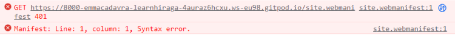

After looking into it, this was easily resolved by adding crossorigin="anonymous" to the respective link tag within the head of the website. 

### Responsive Design and Functionality

This website's functionality has been tested and confirmed as fully responsive across different breakpoints on the following browsers:

* Google Chrome
* Mozilla Firefox
* Microsoft Edge
* Opera
* Safari

In order to help me test the website on different operating systems (such as Mac, iOS for iPhone, Android and Windows) as well as different browsers, I utilised the fantastically useful [**BrowserStack**](https://www.browserstack.com/live).

### Testing of Site Features

When testing the website's features across different browsers, I was not only checking that the visual elements of the pages were working as intended, but also the JavaScript functions as without them, the website would be redundant.

#### HTML and CSS

Because this website uses multiple layers of Flexbox throughout the entire body of each page, it was important for me to test the responsiveness across as many environments and screen dimensions as possible - particularly on Safari, certain elements of Flexbox such as Flexbox gap were not supported until version 14 and beyond.

All of the screenshots found in the README.md file were taken on Google Chrome for desktop, so I have included below screenshots of the homepage on different browsers.

Firefox (Windows):

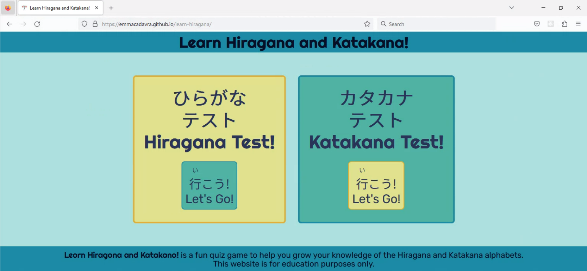

Opera (Windows):

Safari (MacOS):

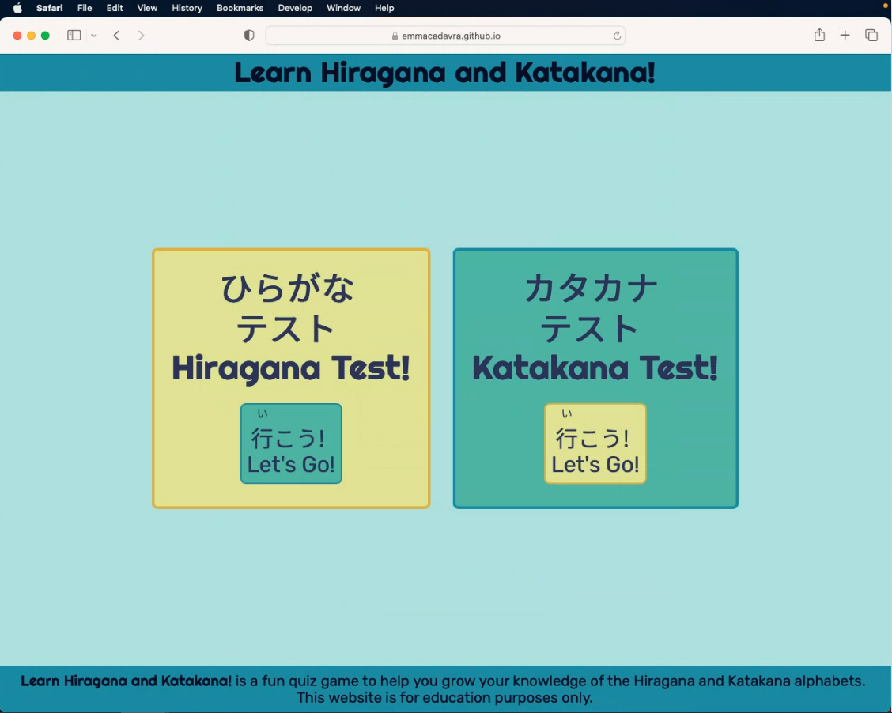

iPhone 14 (iOS):

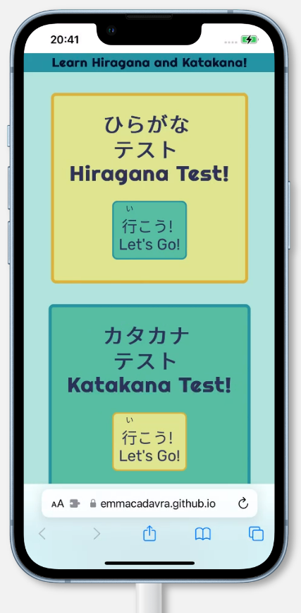

Samsung Galaxy S23 (Android):

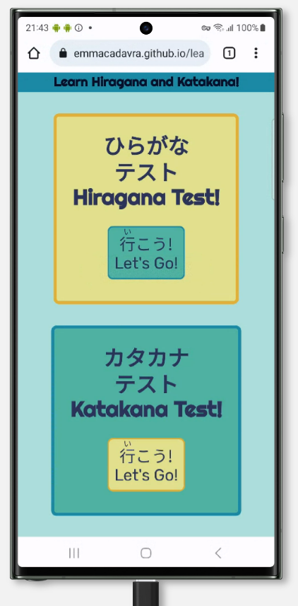

The site title in the header also serves as a link back to index.html, so to test this in each environment I clicked it to make sure it always navigated back to the homepage, without leaving any text decoration such as turning purple to indicate it had been visited before. Similarly, to test the functionality of the select game buttons, I hovered over them with my mouse in all browsers to ensure the animation worked, and that each link directed me to the correct corresponding page.

From the game pages themselves, I once again tested the site title to make sure I was being taken back to the homepage, and I also tested the Back to Game Menu button to ensure it did the same.

#### JavaScript

Testing the JavaScript features of this website as I went along was crucial, as I needed to take a step-by-step approach to make sure each part of the code was working as intended.

A significant amount of trial and error was involved with the JavaScript on this website, and my primary method of testing was through the use of the 'python3 -m http.server' Git command, so that I could create a local server and view the website in Chrome. Using Chrome DevTools, I was able to add and remove JavaScript statements and use the console.log function to log things as they were happening. I utilised this often, but also sometimes did the same thing within my IDE itself.

Testing the game functions at first largely involved reloading the game pages over and over again after making tweaks to the script, until things started appearing where I wanted them to appear. Initially, I only had one .js file which I had intended to run both games from, but as development went on I came across all manner of issues with this - many of which are included in the Bugs section below.

For some segments of code, I utilised the Debugger tool in my IDE by setting breakpoints and trying to identify the issue, though this was not always successful as the issue was not always where I expected it to be!

Once I had resolved the bugs mentioned below (and many more), I tested the functionality of the games by, essentially, playing them over and over again. Each time I checked that the small animation on the answer buttons worked, and that when clicked, the correct class was applied ("correct" or "incorrect") depending on the answer. I also used the console.log function to check that the functions were definitely working as intended while I was testing them - for example that the arrays were being manipulated correctly, that they were being shuffled, and that the current question was being spliced from the available questions array. I ran the game over and over on multiple browsers, in a desktop environment and a mobile environment, and made sure to try getting as many different scores as possible to make sure the messages at the end of the game were working correctly. I made sure to click the "Play Again" and "Choose a Different Game" buttons often to make sure they redirected the user to the correct location.

Below are some screenshots from Safari, iPhone and Android of the games running correctly, as well as the correct end game messages appearing:

Correct answers working on both games on Safari:

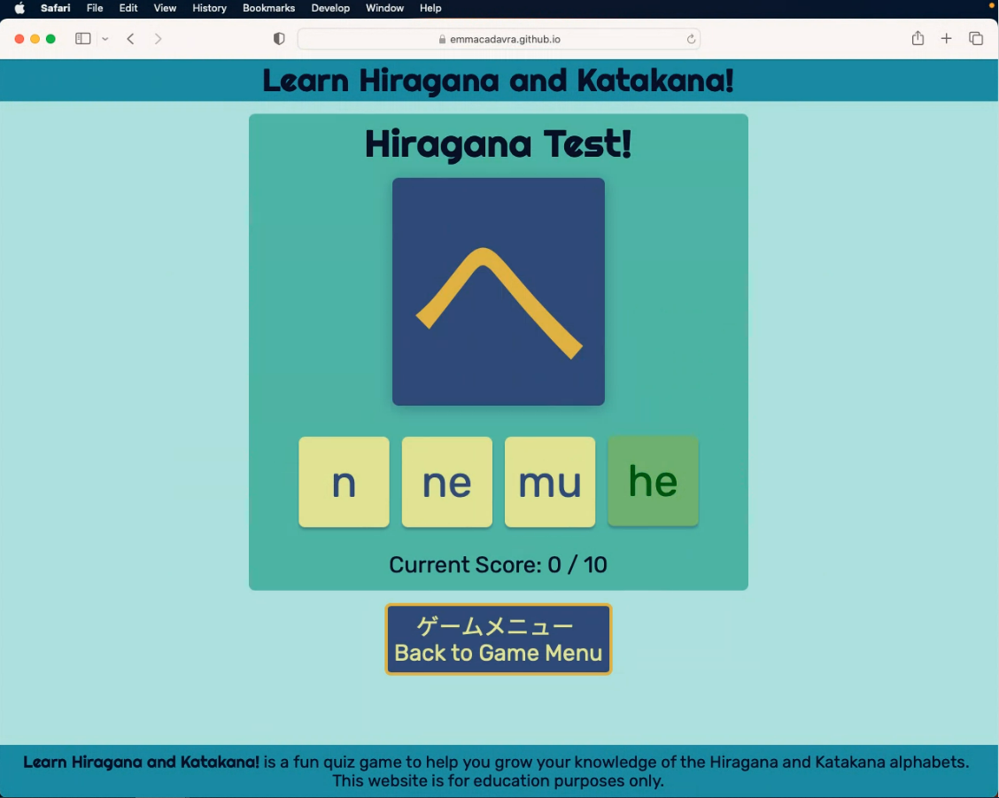

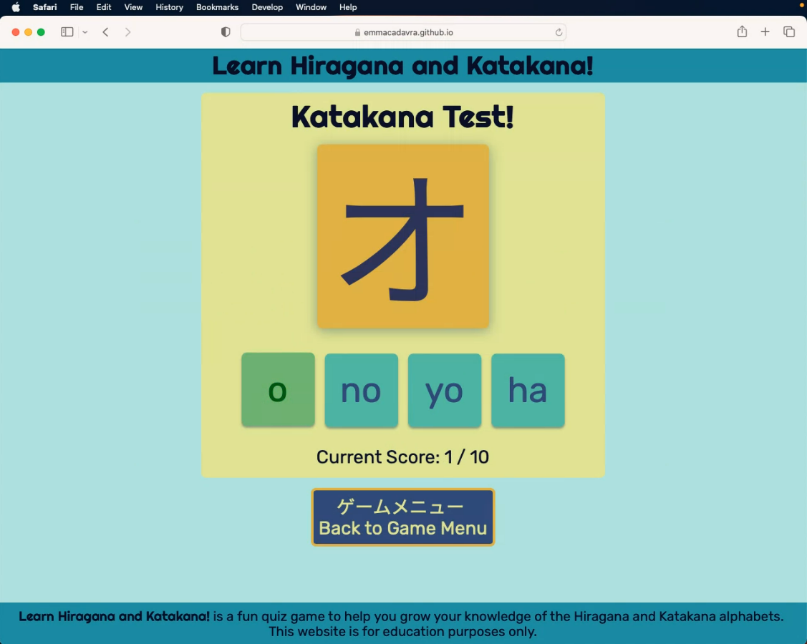

Both games and end game message working correctly on iPhone:

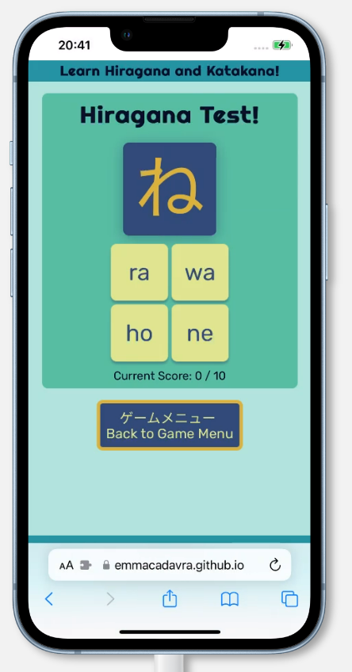

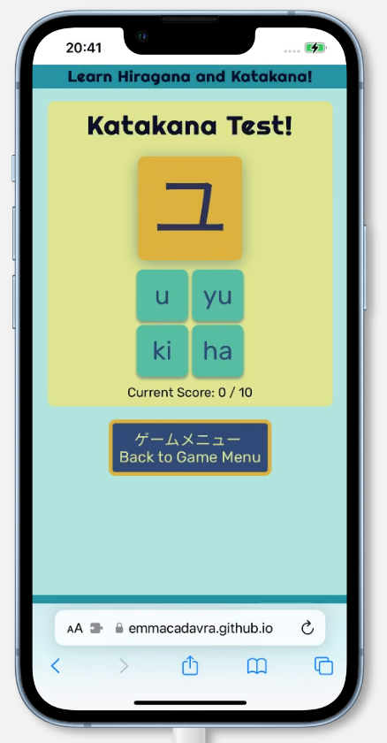

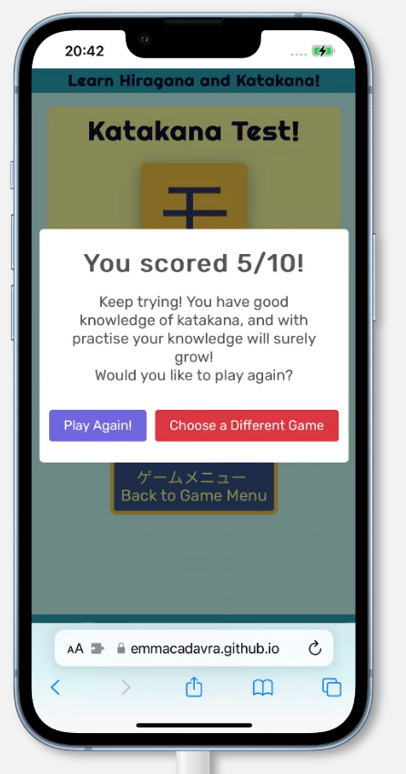

Both games and end game message working correctly on Android (Samsung):

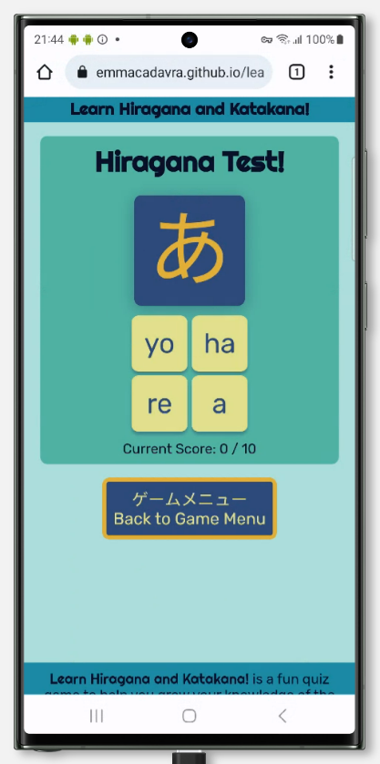

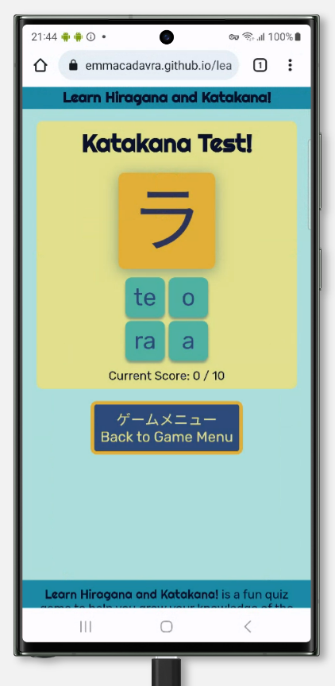

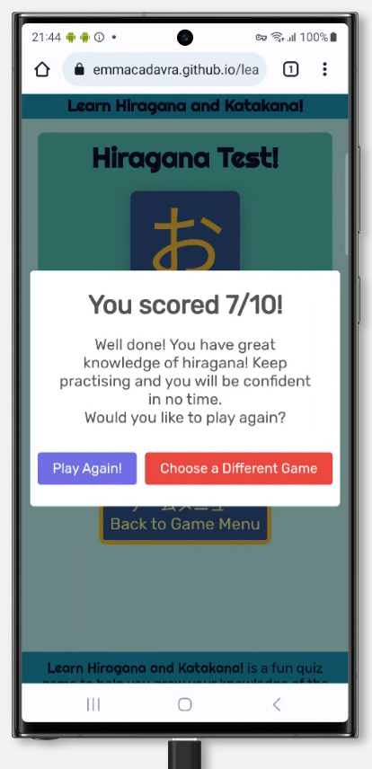

I also tested the site on my own mobile phone, which is a Xiaomi Poco X3 Pro (ie, not a very common model) to make sure the site wasn't just functional on the major brands.

### Bugs

As mentioned previously, I encountered a great many bugs during the development of this website - most of which being a result of my inexperience with JavaScript. I have listed the most noteworthy ones below.

* When I first created my JavaScript functions, they were all in one .js file that set out to distinguish between the hiragana and katakana games by naming every single variable accordingly (newHiraganaQuestion, newKatakanaQuestion, and so on). To attempt to control which game was run, I added the following code to the top of the document:

"document.addEventListener("DOMContentLoaded", function () {
    if (window.location.pathname === "/hiragana.html") {
        runHiraganaGame();
    } else if (window.location.pathname === "katakana.html") {
        runKatakanaGame();
    }
});"

When this didn't work, I tried the GitHub Pages URLS:

"document.addEventListener("DOMContentLoaded", function () {
    if (window.location.href === "https://emmacadavra.github.io/learn-hiragana/hiragana.html") {
        runHiraganaGame();
    } else if (window.location.href === "https://emmacadavra.github.io/learn-hiragana/katakana.html") {
        runKatakanaGame();
    }
});"

This also did not work, so I tried the following:

"document.addEventListener("DOMContentLoaded", function () {
    let url = window.location.pathname;
    if (url.match("/hiragana.html")) {
        runHiraganaGame();
    } else if (url.match("/katakana.html")) {
        runKatakanaGame();
    }
});"

This did run the correct game on each webpage, however - despite the katakana game running correctly when the page loaded, the game would not function as the webpage was trying to call the newHiraganaQuestion function despite clear declarations to separate the two. As a quick but temporary fix for this, I separated the two into separate .js files. It wasn't long before I understood the enormous and unnecessary duplication of code used in all methods attempted above.

* Initially within my newHiraganaQuestion function, I made several incorect declarations that caused the game not to work properly (or in some cases at all). I declared "const buttons = document.getElementsByTagName("button");" inside the function, but wanted to call the variable within an event listener outside of the function. This obviously didn't work as the event listener didn't know what to listen for!

* Also within the newHiraganaQuestion function I originally made, I declared "const hiraganaAnswers = [currentHiraganaQuestion.phonetic];" rather than "let hiraganaAnswers = [currentHiraganaQuestion];" - this meant that in my for loop (for (let button of buttons) { button.innerText = hiraganaAnswers[i].phonetic;), I was asking for the phonetic OF the phonetic in the first instance, which of course does not exist. This resulted in an undefined error, as shown below:

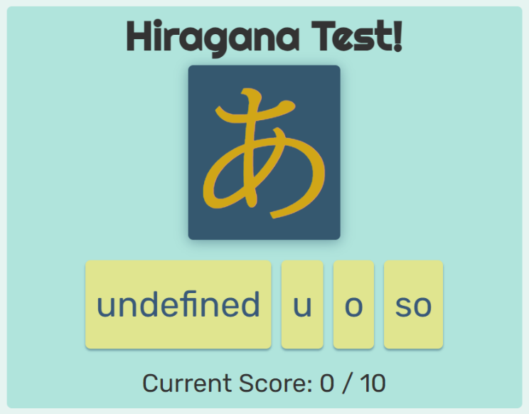

* Upon trying to implement the Fisher-Yates Shuffle Method, I faced a huge number of bugs, mostly relating to different interations of the method being used and it taking a while to find one that worked well with my code. Among the more frustrating bugs is shown in the screenshots below - where the game is running correctly, and the console is correctly logging 4 shuffled potential answers, but the output is 4 lots of the first phonetic only:

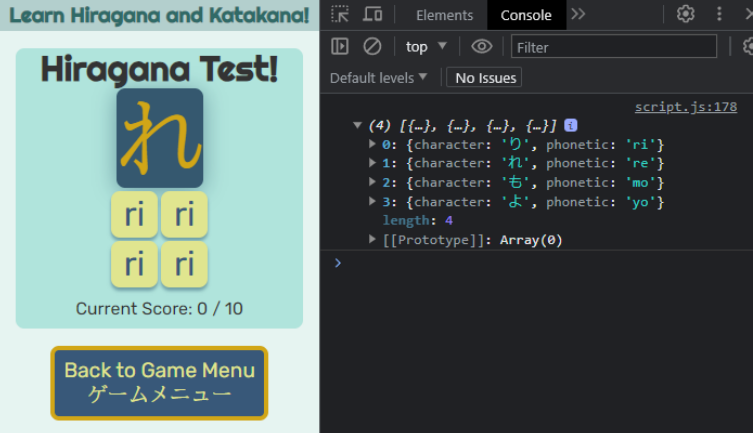

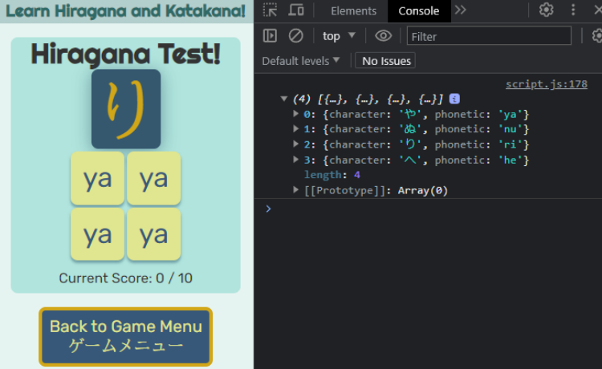

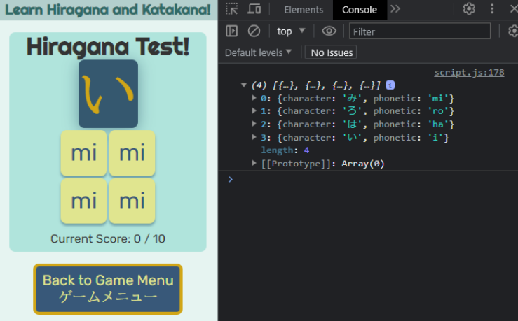

Eventually this bug was fixed by finding the variation of the method mentioned in the Credits section of the README.md file.

* I faced a bug when it came to the SweetAlert2 endGameMessage if/else condition statements, which I discovered was for 2 separate reasons. The bug was that, regardless of the user score, the alert displayed would always contain the 10 out of 10 message:

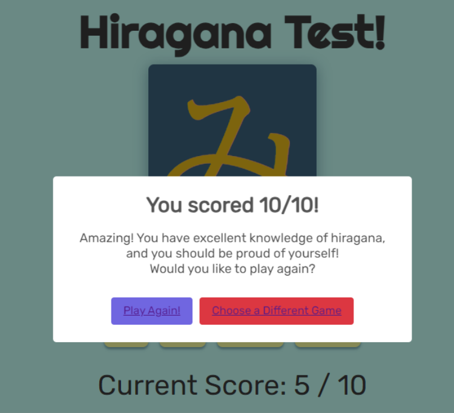

Upon investigating this, the first mistake I realised I had made was in the "click" event listener, where I had included the statement "if (button.innerText === currentHiraganaQuestion.phonetic) {
    hiraganaScore++;
}" - by saying "button.innerText", I was telling the code to increase the score if ANY of the buttons included the correct answer, which obviously one of them always did.

However, even after fixing this, I was still having the same issue, but in the end I discovered that it was because within the endGameMessage function, I had entered "if (score = 10)" rather than "if (score === 10)" - this meant that I was trying to reassign the variable and it was causing the rest of the code not to run.

* Whilst looking into the above bug, I also noticed that I was getting a console error when reaching the end of the game, and this was because I had missed out a "return" statement if the maximum number of questions had been reached, so the code was still trying to run but couldn't. Naturally I fixed this by adding a "return" statement.

* Occasionally, I was finding that questions would be repeated, despite having a rule inside the newQuestion function that said to splice the curret question out of the availableQuestions array. This was due to a misunderstanding on my part, where I had written "availableQuestions.splice(questionIndex, 0)" rather than "availableQuestions.splice(questionIndex, 1)", as I was getting mixed up with which way round the parameters were (I was thinking that it needed to start from index 0, but of course the questionIndex is the index number!)

### Accessibility

A variety of considerations for accessibility were taken into account both during and post-development.

* Continuing with something I learned during my first major project, all CSS measurements are in rem, rather than pixels. This means that the site will still be responsive and look good if the user has changed the default font size in their browser.

* As seen in some of the screenshots in the above Bugs section, the original colour scheme I used for this website was slightly different, and I was quite far into development before I checked the colours on the Colour Grid Contrast Checker. Below is a screenshot of the colours I used, where almost every combination I had used up until that point was either AA18, or DNP. This led me to reconsider the colour scheme for accessibility purposes, which I am very grateful for as it brought me to the beautiful picture which did inspire the final colour scheme.

* The original font I chose for the Japanese text, as mentioned in the Typography section of the README.md file, was styled much more like brush script / calligraphy, which thematically seemed like a good idea initially but in the end it made the text much less readable, so the font was changed to a simpler one that increased readibility. The inclusion of <lang="ja-jp"> for all Japanese text was also added with accessibility in mind, so that screen readers would not confuse the Japanese kanji character on the homepage for a Chinese character, and so that browsers know which characters to load (avoiding blank squares or other symbols).

## Post Development Testing

### Validation

(WAVE Accessibility)

### Unresolved Bugs