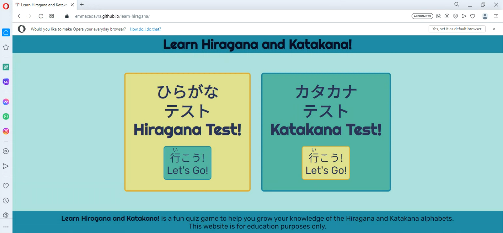

# **Learn Hiragana & Katakana - Testing**

## **Table of Contents (Testing):**
1. [**Testing Throughout Development**](#testing-throughout-development)
    * [***Overview***](#overview)
    * [***Responsive Design and Functionality***](#responsive-design-and-functionality)
    * [***Testing of Site Features***](#testing-of-site-features)
        * [*HTML and CSS*](#html-and-css)
        * [JavaScript](#javascript)
    * [***Bugs***](#bugs)
    * [***Accessibility***](#accessibility)
1. [**Post Development Testing**](#post-development-testing)
    * [***Validation***](#validation)
        * [*HTML Validation*](#html-validation)
        * [*CSS Validation*](#css-validation)
        * [*Lighthouse Scores and PageSpeed Insights*](#lighthouse-scores-and-pagespeed-insights)
    * [***Unresolved Bugs***](#unresolved-bugs)

## Testing Throughout Development

### Overview

During the development of this project, I manually tested the wesbite and its code primarily by using the 'python3 -m http.server' command in GitPod and CodeAnywhere's VSCode workspace, which created a love instance of the website that updated in real time every time I saved my code within the IDE. My default browser is Google Chrome, so I also heavily utilised Chrome's DevTools to allow me to test the site's responsive design, tweak elements of the code for bug fixing purposes, and crucially to use the console to aid me in creating JavaScript functions.

When the website itself was more or less "put together", I deployed it to GitHub pages so that I could test it not only in my own testing environment, but also in a live environment. This proved useful on several occasions - for example, while I received no errors for my favicon's site.webmanifest file in my testing environment, I did receive the following console error on the deployed GitHub Pages website:

After looking into it, this was easily resolved by adding crossorigin="anonymous" to the respective link tag within the head of the website. 

### Responsive Design and Functionality

This website's functionality has been tested and confirmed as fully responsive across different breakpoints on the following browsers:

* Google Chrome
* Mozilla Firefox
* Microsoft Edge
* Opera
* Safari

In order to help me test the website on different operating systems (such as Mac, iOS for iPhone, Android and Windows) as well as different browsers, I utilised the fantastically useful [**BrowserStack**](https://www.browserstack.com/live).

### Testing of Site Features

When testing the website's features across different browsers, I was not only checking that the visual elements of the pages were working as intended, but also the JavaScript functions as without them, the website would be redundant.

#### HTML and CSS

Because this website uses multiple layers of Flexbox throughout the entire body of each page, it was important for me to test the responsiveness across as many environments and screen dimensions as possible - particularly on Safari, certain elements of Flexbox such as Flexbox gap were not supported until version 14 and beyond.

All of the screenshots found in the README.md file were taken on Google Chrome for desktop, so I have included below screenshots of the homepage on different browsers.

Firefox (Windows):

Opera (Windows):

Safari (MacOS):

iPhone 14 (iOS):

Samsung Galaxy S23 (Android):

The site title in the header also serves as a link back to index.html, so to test this in each environment I clicked it to make sure it always navigated back to the homepage, without leaving any text decoration such as turning purple to indicate it had been visited before. Similarly, to test the functionality of the select game buttons, I hovered over them with my mouse in all browsers to ensure the animation worked, and that each link directed me to the correct corresponding page.

From the game pages themselves, I once again tested the site title to make sure I was being taken back to the homepage, and I also tested the Back to Game Menu button to ensure it did the same.

#### JavaScript

### Bugs

### Accessibility

A variety of considerations for accessibility were taken into account both during and post-development.

* Continuing with something I learned during my first major project, all CSS measurements are in rem, rather than pixels. This means that the site will still be responsive and look good if the user has changed the default font size in their browser.

* As seen in some of the screenshots in the above Bugs section, the original colour scheme I used for this website was slightly different, and I was quite far into development before I checked the colours on the Colour Grid Contrast Checker. Below is a screenshot of the colours I used, where almost every combination I had used up until that point was either AA18, or DNP. This led me to reconsider the colour scheme for accessibility purposes, which I am very grateful for as it brought me to the beautiful picture which did inspire the final colour scheme.

* The original font I chose for the Japanese text, as mentioned in the Typography section of the README.md file, was styled much more like brush script / calligraphy, which thematically seemed like a good idea initially but in the end it made the text much less readable, so the font was changed to a simpler one that increased readibility. The inclusion of <lang="ja-jp"> for all Japanese text was also added with accessibility in mind, so that screen readers would not confuse the Japanese kanji character on the homepage for a Chinese character, and so that browsers know which characters to load (avoiding blank squares or other symbols).

## Post Development Testing

### Validation

(WAVE Accessibility)

### Unresolved Bugs